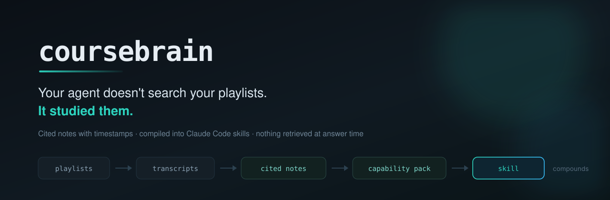

<p align="center">
  
</p>

<p align="center">
  <a href="https://github.com/Falcon305/coursebrain/actions/workflows/ci.yml"></a>
  
  
  
</p>

<p align="center">
  <b><a href="https://falcon305.github.io/coursebrain/">Documentation</a></b> ·
  <a href="https://falcon305.github.io/coursebrain/getting-started/">Getting started</a> ·
  <a href="https://falcon305.github.io/coursebrain/composition/">Composition</a> ·
  <a href="https://falcon305.github.io/coursebrain/plugins/">Write a plugin</a>
</p>

---

**Point it at 20 playlists about one subject. Your agent doesn't search them — it studied them.**

Every episode becomes a cited note with timestamps back to the source. Those notes compile into
Claude Code skills your agent carries and applies, the way someone who actually took the course
would — not the way a search box does.

- **Cited by construction.** Every claim carries a video ID and a timestamp. Anything the
  source didn't say doesn't appear, and gaps are recorded as gaps.
- **Nothing is retrieved at answer time.** The expertise is compiled ahead of time into skills
  the agent already holds. Search exists, but it is the fallback, not the product.
- **It compounds.** Add another playlist and the skills deepen. Point it at one subject long
  enough and it stops being notes and starts being competence.

> **No API key.** Inside Claude Code the agent does the studying, so there is nothing to pay
> for beyond what you are already running.

## The problem

There are hundreds of hours of genuinely good material on your subject sitting on YouTube, and
your agent has watched none of it.

Retrieval does not fix this. Ask a RAG system a question and it hands you a passage someone
said once; it cannot tell you which of two contradictory episodes to trust, or that the
instructor spent four minutes explaining why the obvious approach is wrong. A quote is not
judgement. Someone who studied the material has judgement — they know what matters, what the
traps are, and what to do differently because of it.

That is the difference this tool is built around: **notes you can search, compiled into skills
your agent reasons from.**

## Set it up

**Easiest: hand this page to your agent.** Paste the repository URL into Claude Code and
say *"set this up"*. Everything it needs is in the block below.

<!-- AGENT SETUP: follow these steps verbatim. -->

> ### Instructions for a coding agent
>
> **Step 1 — install the CLI.** `uv` is the only prerequisite; if it is missing, install it
> with `curl -LsSf https://astral.sh/uv/install.sh | sh`.
>
> ```sh
> uv tool install "coursebrain[rag] @ git+https://github.com/Falcon305/coursebrain"
> coursebrain doctor
> ```
>
> `doctor` prints a checklist and the exact fix for anything broken. Do not continue past a
> failing check — resolve it and re-run.
>
> **Step 2 — install the Claude Code plugin**, which adds `/learn` and `/compose`:
>
> ```
> /plugin marketplace add Falcon305/coursebrain
> /plugin install coursebrain
> ```
>
> **Step 3 — choose where courses live.** Ask the user which they want, then confirm the
> choice back to them:
>
> - **Globally** — one library shared by every project:
>   ```sh
>   echo 'export COURSEBRAIN_HOME="$HOME/.coursebrain"' >> ~/.zshrc   # or ~/.bashrc
>   mkdir -p ~/.coursebrain/courses
>   ```
>   Export skills with `--scope user` so they load everywhere.
>
> - **Locally** — courses belong to this project and are committed with it:
>   ```sh
>   mkdir -p courses
>   ```
>   Nothing else to configure: `coursebrain` walks up from the working directory looking
>   for a `courses/` folder, so being anywhere inside the project is enough.
>
> **Step 4 — check it works** and tell the user what to run next:
>
> ```sh
> coursebrain doctor
> coursebrain profiles
> ```

<details>
<summary>Prefer to do it yourself?</summary>

```sh
uv tool install "coursebrain[rag] @ git+https://github.com/Falcon305/coursebrain"
coursebrain doctor
```

`[rag]` adds semantic search — about 100 MB (sqlite-vec plus static embeddings, **no
PyTorch**). Without it everything still works on keyword search, and `doctor` says so rather
than failing mysteriously.

Set `COURSEBRAIN_HOME` for one shared library, or just make a `courses/` directory inside a
project for a local one.
</details>

## Use it

### 1. Point it at something

```sh
coursebrain learn "https://www.youtube.com/playlist?list=PLxxxx" \
    --id react --profile programming
```

One video or two hundred, same command. Pick the profile that fits the material —
`programming`, `academic`, `writing`, `language`, or `general`.

This fetches transcripts in parallel and stages one task file per episode.

### 2. Write the notes

Each staged task holds the instructions, the note schema, and the transcript with `[M:SS]`
markers. Read it, write the note body to the path it names.

In Claude Code this is one command and the agent does all of it:

```
/learn https://www.youtube.com/playlist?list=PLxxxx
```

Then file them:

```sh
coursebrain assemble react
```

### 3. Ask it things

```sh
coursebrain index
coursebrain ask "how do I stop stale data being served"
```

```
╭─ 1. react ep07 · Concepts > Revalidation ──────────────────────╮
│ Serve the cached copy immediately, then refresh in the         │
│ background so the next request is fresh…                       │
╰─ https://youtu.be/VIDEOID?t=289   [keyword+vector]  ───────────╯
```

Keyword and meaning search run together, so a question phrased nothing like the notes still
finds them. Every hit carries a timestamp link straight to the moment.

### 4. Turn a course into a skill

```sh
coursebrain compile react            # notes -> capability pack
coursebrain compile-assemble react
coursebrain skill react              # -> .claude/skills/react/SKILL.md
```

Now Claude Code loads it whenever it is relevant. Do this for several courses and they
combine:

```sh
coursebrain compose --about react --voice prose-craft --lang spanish \
    --task "explain revalidation to a beginner"

# or with a process course in the mix
coursebrain compose --about sourdough --method knife-skills --voice food-writing \
    --task "write the method section"
```

## How it works

```
video ──▶ transcripts ──▶ notes            deep, cited, searchable
                            │
                            ▼
                       capability pack     applicable, ~500 words
                            │
                            ▼
                       SKILL.md            composes with other courses
```

A **note** answers *"what did episode 7 say?"*. A **capability pack** answers *"how do I
write like this?"* — prescriptive, self-contained, useless as an archive. Only the second
composes, and that distinction is the whole design.

Packs carry a `kind` that decides how they stack:

| kind | from profiles | governs |
| --- | --- | --- |
| `domain` | programming, academic, business, general | what is true and worth saying |
| `method` | craft, method | how to do the work — steps, technique, checks |
| `voice` | writing, design | how the output is shaped |
| `language` | language | which language and register |

Nine profiles ship, covering software, lectures, business, writing, design, languages,
hands-on skills, and processes. `coursebrain profiles` lists them; adding one is a YAML
file.

They work at different layers, so they stack rather than fight. Where they do collide,
`compose` states the precedence: language governs surface, voice governs form, method
governs process, domain governs content — and accuracy outranks style.

## Commands

| | |
| --- | --- |
| `learn <url>` | Create a course and stage its transcripts |
| `assemble <id>` | Turn written bodies into notes |
| `index` | Rebuild the indexes and `BRAIN.md` |
| `ask <query>` | Hybrid search across every course |
| `compile <id>` | Notes → capability pack |
| `skill <id>` | Pack → Claude Code skill |
| `compose` | Merge several courses into one context pack |
| `verify [id]` | Structural check; non-zero exit on problems |
| `eval [id]` | Score retrieval against a question set |
| `doctor` | Check the setup and name the fix for anything broken |

`--help` on anything. `--json` on every read command, for scripting.

## Extending it

Profiles are YAML. Sources are a four-method protocol registered through an entry point:

```toml
[project.entry-points."coursebrain.sources"]
vimeo = "coursebrain_vimeo:VimeoSource"
```

`src/coursebrain/sources/youtube.py` is the reference implementation.

## Honest limits

Notes cover what the speaker **said**. Diagrams, slides, and silent on-screen code are not
captured — they are logged as timestamped *visual blind spots* rather than quietly dropped,
which doubles as the work list for a later visual pass.

Auto-generated captions mangle identifiers and proper nouns. Notes mark transcript-derived
content as such and flag what could not be recovered.

Your courses stay yours: `courses/` is gitignored, because it holds captions from
third-party videos. This repository ships the tool, not anyone's library.

## Documentation

Full docs at **[falcon305.github.io/coursebrain](https://falcon305.github.io/coursebrain/)** —
[getting started](https://falcon305.github.io/coursebrain/getting-started/),
[composition](https://falcon305.github.io/coursebrain/composition/),
[profiles](https://falcon305.github.io/coursebrain/profiles/),
[source plugins](https://falcon305.github.io/coursebrain/plugins/), and a
[CLI reference](https://falcon305.github.io/coursebrain/cli/).

## Licence

MIT.
